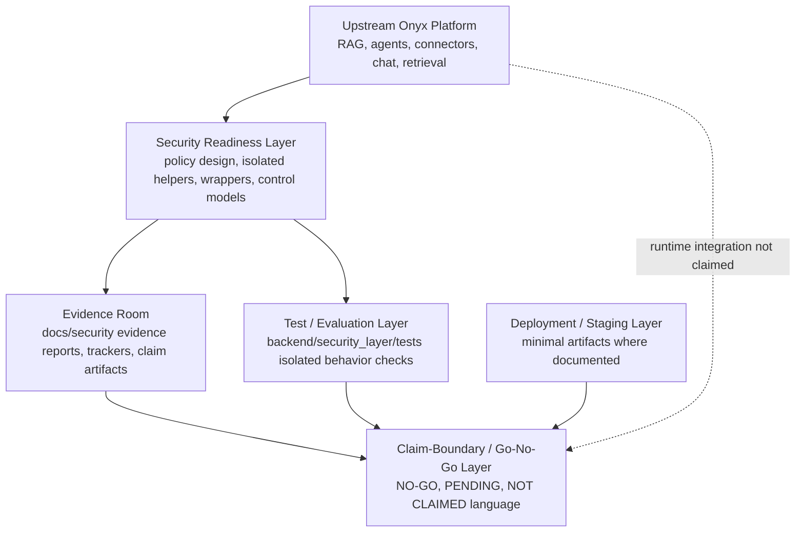

# Architecture Overview

This portfolio package separates the upstream Onyx application foundation from the AI security-readiness work layered around it. The goal is to make the project reviewable as a production-style portfolio and partner-demo evidence package, not to assert production or enterprise deployment readiness.

## High-Level Architecture



## Upstream Onyx Platform

The base application is an Onyx-based RAG and agent platform with connectors, retrieval, chat, LLM workflows, and related application infrastructure. Upstream Onyx provides the application foundation and product surface; this portfolio package does not re-label upstream platform maturity as this repository's production readiness.

## Security Readiness Layer

The security-readiness layer contains portfolio work such as policy/control design, isolated helper modules, runtime-context concepts, safe-denial design, evidence models, final-review helpers, and tests. Many controls are isolated, documentation-only, or monitor-only unless existing repository evidence proves otherwise. Live enforcement is not claimed.

## Evidence Room

The evidence room under `docs/security/` records execution trackers, evidence reports, known limitations, partner-safe claims, final claim boundaries, and related evidence bundles. It is designed to help reviewers distinguish what is implemented, what is isolated, what is staged minimally, what is pending, and what remains explicitly NO-GO.

## Test / Evaluation Layer

The test/evaluation layer focuses on isolated security-layer behavior, primarily through:

```bash
PYTHONPATH=. python -m pytest backend/security_layer/tests -q
```

Passing tests demonstrate behavior of the isolated security-layer helpers covered by those tests. They do not prove production security, live runtime enforcement, full Onyx integration, or enterprise readiness.

## Deployment / Staging Layer

Deployment/staging evidence is limited to artifacts that exist in the repository, including minimal Oracle/Coolify or docker-compose evidence where documented. Minimal nginx or health-check staging evidence is not equivalent to full Onyx live staging and is not evidence of production-grade monitoring, rollback, backup, or security enforcement.

## Claim-Boundary / Go-No-Go Layer

The claim-boundary layer keeps reviewer language honest:

- production readiness remains **NO-GO**,
- enterprise readiness remains **NO-GO**,
- external validation remains **PENDING**,
- compliance certification is **NOT CLAIMED**,
- live enforcement is not claimed.

This architecture is therefore best understood as a production-style portfolio readiness package around an Onyx-based system, not an enterprise production deployment.
